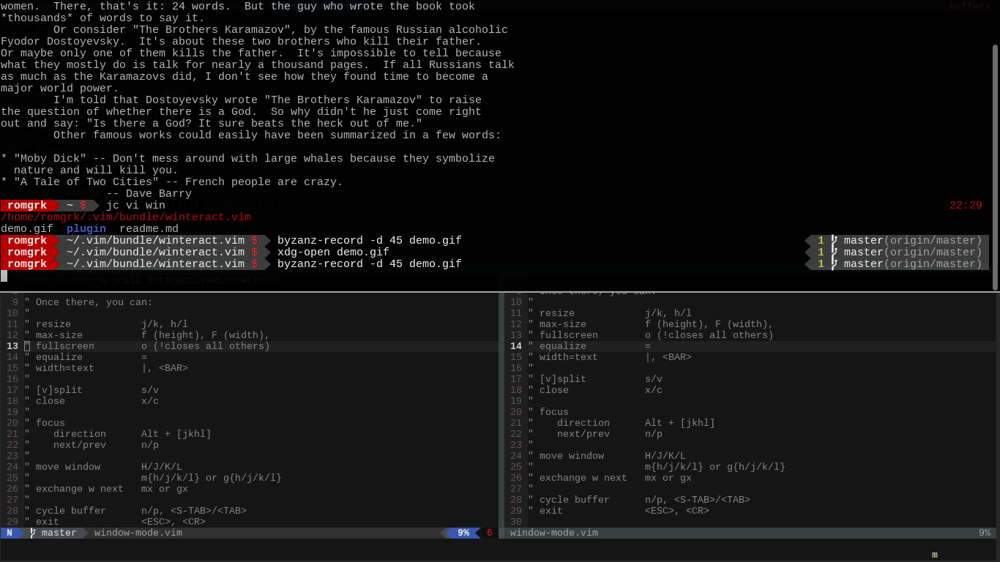

# Winteract.vim

An interactive-window mode, where you can resize windows by
repeatedly pressing j/k and h/l, amongst other things.

Also:
split, close, move, change focus, fullscreen, cycle buffer,
fullwidth, fullheight, set width to textwidth, exhange position
with next window.



## Mappings

```viml
nmap gw        :call InteractiveWindow()<CR>
nmap <leader>w :call InteractiveWindow()<CR>
```

This calls interactive-window-mode
Once there, you can: 

```
  - resize            j/k, h/l
  - max-size          f (height), F (width), 
  - fullscreen        o (!closes all others)
  - equalize          =
  - width=text        |, <BAR> 
  
  - [v]split          s/v
  - close             x/c
  
  - focus             
    - direction       Alt + [jkhl]
    - next/prev       n/p
  
  - move window       H/J/K/L  
                      m{h/j/k/l} or g{h/j/k/l}
  - exchange w next   mx or gx
  
  - cycle buffer      n/p, <S-TAB>/<TAB>
  - exit mode         <ESC>, <CR>
```

Here is the complete table. (you can add stuff, it's golbal)

```viml
let winmap.normal = {
\
\ "h": "normal! \<C-w><" , "=": "normal! \<C-w>=" ,
\ "j": "normal! \<C-w>-" , "f": "normal! \<C-w>_" ,
\ "k": "normal! \<C-w>+" , "F": "normal! \<C-w>|" ,
\ "l": "normal! \<C-w>>" , "o": "normal! \<C-w>o" ,
\
\ "|": "normal! :\<C-r>=&tw\<CR>wincmd |\<CR>" ,
\ 
\ "\<A-h>": "normal! \<C-w>h" ,  "H": "normal! \<C-w>H" ,
\ "\<A-j>": "normal! \<C-w>j" ,  "J": "normal! \<C-w>J" ,
\ "\<A-k>": "normal! \<C-w>k" ,  "K": "normal! \<C-w>K" ,
\ "\<A-l>": "normal! \<C-w>l" ,  "L": "normal! \<C-w>L" ,
\
\ "x": "normal! \<C-w>c" , "n": "normal! :bn\<CR>" ,
\ "c": "normal! \<C-w>c" , "p": "normal! :bp\<CR>" ,
\ "s": "normal! \<C-w>s" , "\<TAB>": "normal! :bn\<CR>" ,
\ "v": "normal! \<C-w>v" , "\<S-TAB>": "normal! :bp\<CR>" ,
\ 
\ "w": "normal! \<C-w>w" ,
\ "W": "normal! \<C-w>w" ,
\ "P": "normal! \<C-w>P" ,
\ "q": "normal! :copen\<CR>" ,
\
\ "g": "let g:winmode='move'" ,
\ "m": "let g:winmode='move'" ,
\
\ "\<ESC>": "let exitwin=1" ,
\ "\<CR>": "let exitwin=1" ,
\}

let winmap.move = {
\ "h": "normal! \<C-w>H" ,
\ "j": "normal! \<C-w>J" ,
\ "k": "normal! \<C-w>K" ,
\ "l": "normal! \<C-w>L" ,
\ "x": "normal! \<C-w>x" ,
\ "\<ESC>": "\" NOP" ,
\ }
```
